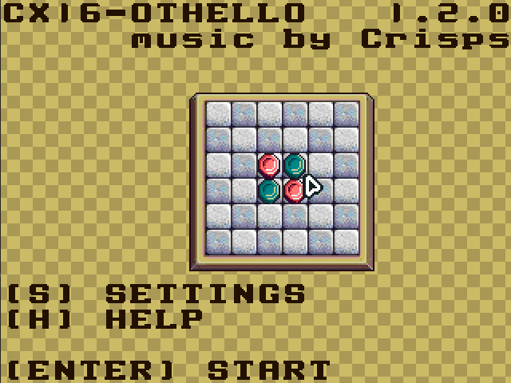

# CX16-OTHELLO


[](https://github.com/ifilot/cx16-othello/actions/workflows/build.yml)
[](https://www.gnu.org/licenses/gpl-3.0)

[Download latest version](https://github.com/ifilot/cx16-othello/releases/latest/download/CX16-OTHELLO.ZIP)

Othello for the Commander X16 is a modern adaptation of the classic strategy
board game, tailored for the retro charm of the X16 platform. Known for its
simple yet strategic gameplay, Othello challenges players to outmaneuver their
opponent by flipping discs (stones) on an 8x8 board. The objective is to have
the majority of stones in your color when the board is filled.



The Commander X16 version faithfully recreates this experience with an intuitive
interface, nostalgic pixel art, and responsive controls, offering both
single-player and two-player modes. In single-player, the AI provides varying
levels of difficulty, catering to both beginners and seasoned strategists. The
two-player mode allows friends to go head-to-head, making it a perfect game for
social gatherings.

This version also includes classic sound effects and music that enhance the
retro feel, staying true to the X16's ethos of combining modern programming with
vintage aesthetics. Whether you're reliving the memories of yesteryear or
discovering Othello for the first time, the Commander X16 version is a
delightful blend of old and new, bringing timeless fun to your gaming
collection.

## Game Features

1. **Playing modes**:
    - Human versus Human
    - Human versus Computer
    - Computer versus Computer

2. **Board Sizes**:
    - 6x6
    - 8x8
    - 10x10

3. **Board Styles**:
    - Stone
    - Wood

4. **Disc Colors**:
    - 10 different stone colors to choose from

## Othello Rules

Othello, also known as Reversi, is a two-player strategy board game played on an
8x8 grid. Here are the basic rules:

### Setup
The game starts with four stones placed in the center of the board in a square
formation. Each player has stones of one color, typically black and white. The
initial setup has two black stones and two white stones arranged with black on
top left and bottom right, and white on top right and bottom left.

### Gameplay
- Players take turns placing a disc of their color on an empty square on the board.
- A legal move must outflank one or more of the opponent's stones. To outflank
  means to place a disc such that one or more straight (horizontal, vertical, or
  diagonal) lines of the opponent's stones are trapped between the newly placed
  disc and another disc of the player's color.
- All of the opponent's outflanked stones are flipped to the player's color.

### Objective
The game continues until neither player can make a legal move, usually when the
board is full. The player with the most stones of their color on the board at
the end of the game wins.

### Additional Rules
- If a player cannot make a legal move, they pass their turn to the opponent.
- If neither player can make a move, the game ends.

These straightforward rules lead to complex and strategic gameplay, where each
move can significantly alter the state of the board and the potential outcomes
of the game.

## Compilation

First, install the required dependencies

```bash
sudo apt-get install -y build-essential cc65 python3 python3-numpy python3-pilkit
```
Compilation is fairly straightforward. Go to the `src` folder and run `make`.

```bash
cd src && make
```

## Dependencies

CX16-Othello makes use of [zsmkit](https://github.com/mooinglemur/zsmkit) which
is an advanced music and sound effects engine for the Commander X16 and
available under a MIT License. A static copy of this library is bundled in
this repository and automatically embedded in the `.PRG` file.

## Assets

* Part of the artwork (specifically the stones and the board) was purchased from
  [Alb_pixel Store at Itch.io](https://alb-pixel-store.itch.io/classic-board-games-assets/devlog/525208/classic-board-games-assets)
  These assets may **not** be copied and used for other projects without explicit
  permission of the author.
  - For $2.00 you can obtain a license to use these in your project
  - I am in no way affiliated with Alb_pixel Store.
* Background music "Corridors of Time" by GTR3QQ is available under a
  CC-BY-SA-4.0 license and obtained from [this source](https://github.com/mooinglemur/melodius/blob/main/ROOT/ZSM/Furnace/GTR3QQ/Corridors%20of%20Time.zsm)
  GTR3QQ is graciously acknowledged for producing this piece of music and offering
  it under a liberal license.

## Community guidelines

* Contributions to CX16-Othello are always welcome and appreciated. Before doing so,
  please first read the [CONTRIBUTING](CONTRIBUTING.md) guide.
* For reporting issues or problems with the software, you are kindly invited to
  to open a [new issue with the bug label](https://github.com/ifilot/cx16-othello/issues/new?labels=bug).
* If you seek support in using CX16-Othello, please 
  [open an issue with the question](https://github.com/ifilot/cx16-othello/issues/new?labels=question)
  label.
* If you wish to contact the developers, please send an e-mail to ivo@ivofilot.nl.

## License

Unless otherwise stated, all code in this repository is provided under the GNU
General Public License version 3.